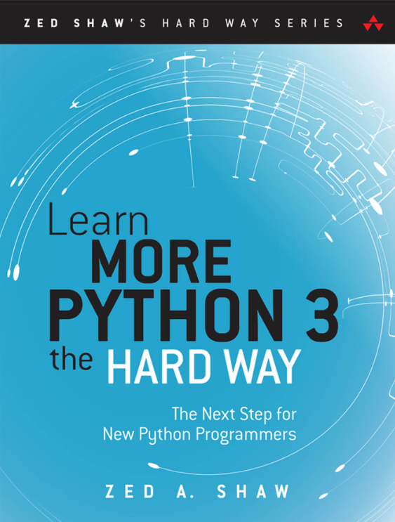
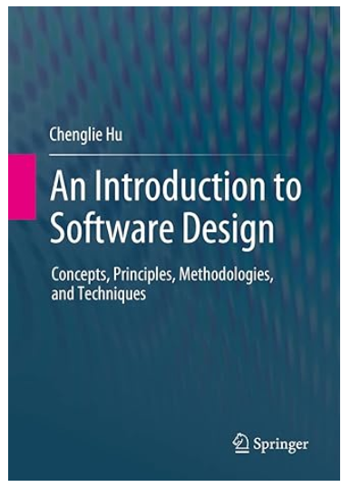
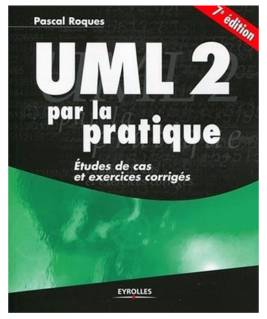
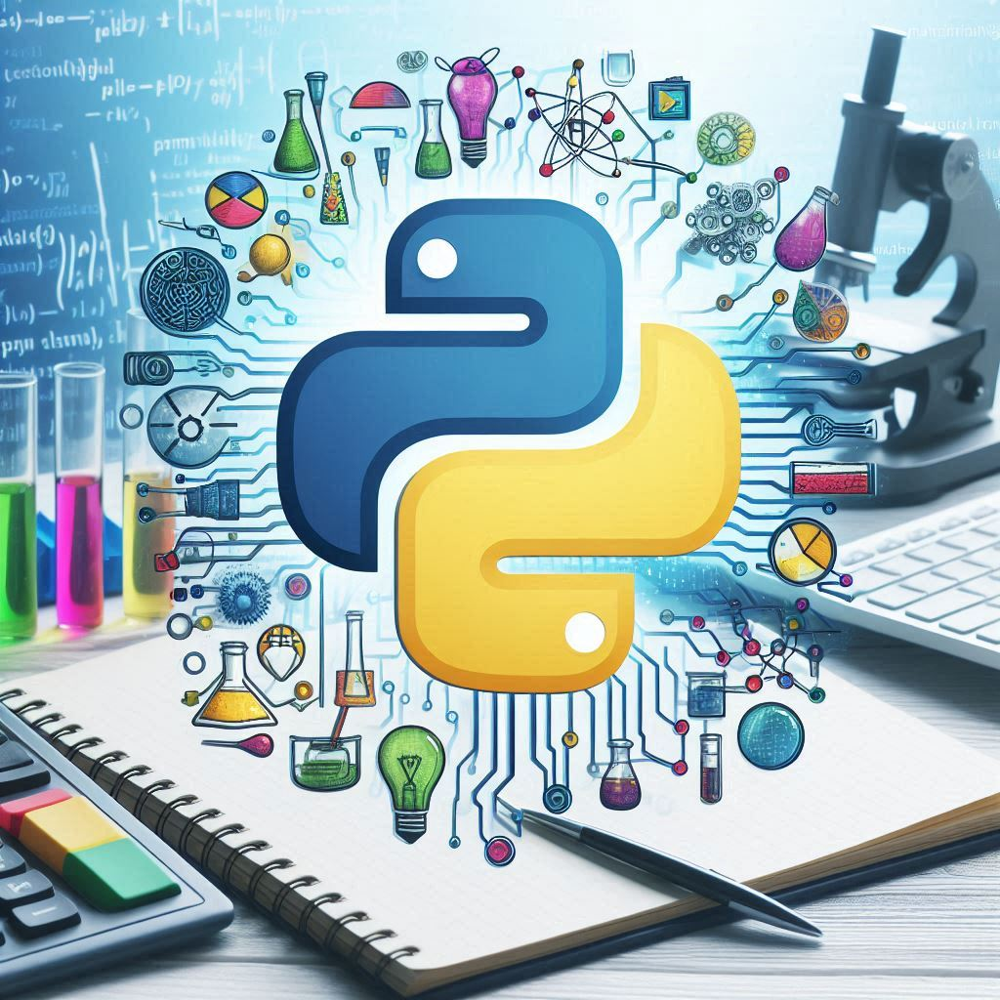
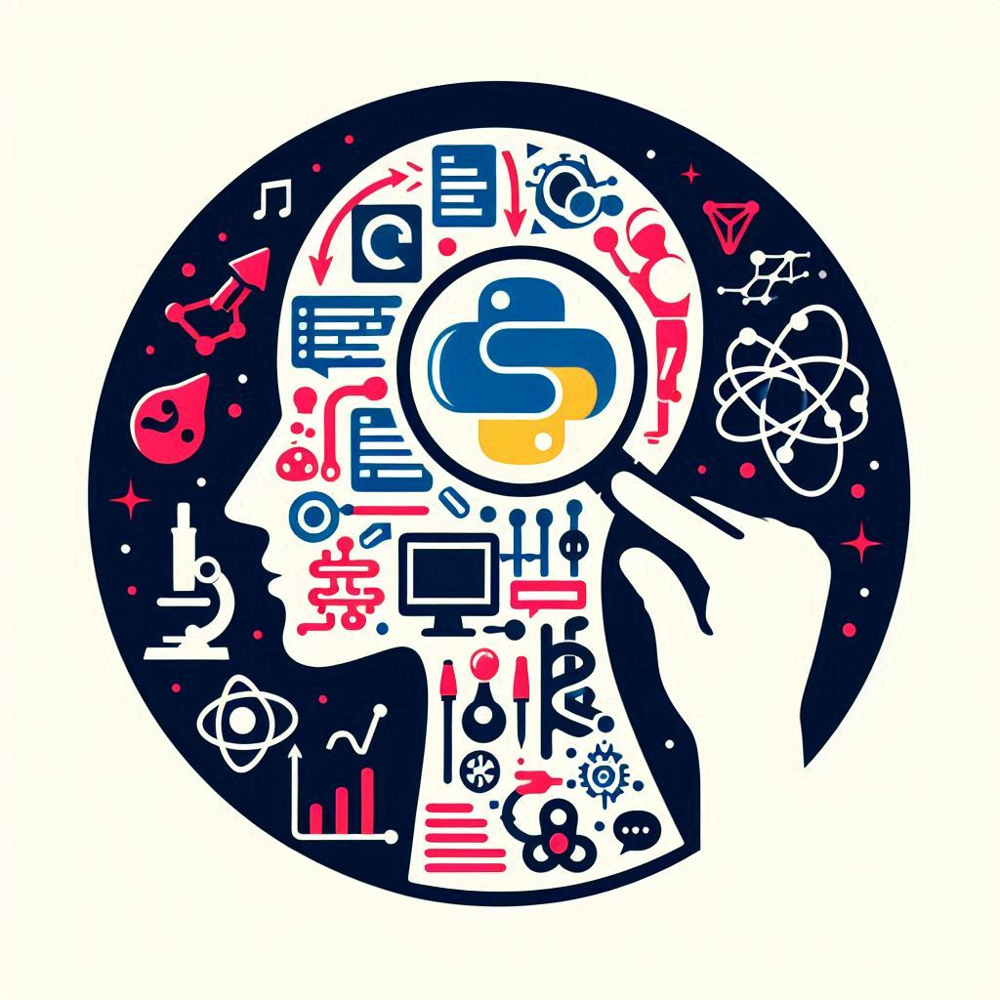

<h1 align="center">Hi 👋, I'm Cédric Bohnert !</h1>
<h2 align="center">An Aspiring AI Engineer from France</h2>
<h2 align="center">⚠️ Actively Looking for A Work-Study AI Engineer Position starting in 2025 ⚠️</h2>

## About Me

  ### 🔭 My Mission for 2025: Advancing in Data Science and AI
  
  In 2025, I am fully committed to enhancing my skills in Data Science and AI while expanding my GitHub portfolio with insightful notes and project showcases. 
  
  In 2024, I built a strong foundation in software engineering, leveraging exceptional learning resources like the **STUDI platform** and the **www.educative.io** platform. My focus has been on mastering core software development principles and hands-on practices.
  
  #### Key Competencies Developed in 2024:
  
  - **Object-Oriented Programming (OOP)**: Proficient in Python and UML-based Object-Oriented Design.
  - **Algorithmic Problem Solving**: Expertise in designing efficient programs using advanced Data Structures.
  - **Database Systems**: Skilled in relational database modeling and implementation with SQL and Python ORM.
  - **API Collaboration**: Adept at integrating and communicating with APIs and libraries using Python.
  - **Software Management & Quality**: Knowledge of Agile SCRUM practices and software engineering principles.
  
  These achievements have prepared me for the next step: diving deeper into Data Science and AI Engineering. My strong foundation in problem-solving, software design, and data modeling ensures I’m ready to tackle advanced machine learning and artificial intelligence concepts.
  
  ---
  
  ### 🌱 My 2025 Learning Objectives:
  
  #### Data Science & AI Specialization:
  - **Data Analysis & Visualization**: Master tools like Pandas, NumPy, Matplotlib, and Seaborn for in-depth data exploration.  
  - **Machine Learning**: Build and evaluate models using scikit-learn; implement algorithms like regression, classification, and clustering.  
  - **Deep Learning**: Develop expertise in TensorFlow and PyTorch for NLP and computer vision tasks.  
  - **Big Data Technologies**: Learn to handle large-scale datasets using Hadoop and Apache Spark.  
  - **Mathematics & Statistics**: Strengthen foundations in linear algebra, calculus, probability, and statistical modeling.  
  - **Software Engineering for AI**: Improve Python programming for AI applications; deploy models with Docker and Kubernetes.  
  - **Advanced AI Topics**: Explore Natural Language Processing (NLP), Computer Vision, and Reinforcement Learning.  
  - **Projects & Collaboration**: Contribute to open-source projects and build a comprehensive Data Science portfolio.  
  - **Certifications**: Achieve industry-recognized certifications and stay updated on the latest trends in AI.
  
  ---
  
  ### 👯 Collaboration & Networking
  
  I’m actively seeking collaborative opportunities in Python programming, Data Science, and AI. If you're enthusiastic about tackling challenging problems or building innovative projects, let’s connect!
  
  #### Why Collaborate with Me?
  
  - **Hands-On Python Expertise**: I continuously refine my Python skills, focusing on AI-driven projects.  
  - **Data-Driven Mindset**: My approach emphasizes end-to-end workflows, from data cleaning to predictive modeling.  
  - **Growth-Oriented**: I embrace lifelong learning through coursework, projects, and collaborations.
  
  ---
  
  ### 💼 Career Aspiration: AI Engineer via Work-Study (Alternance)
  
  I’m pursuing a **work-study (alternance)** position to support my Master’s in AI Engineering with OpenClassrooms. This opportunity would enable me to gain hands-on experience while advancing my education, building a bridge between theory and practice.
  
  Feel free to explore my project. If you know of opportunities aligning with my skills and goals, let’s talk!
  
  ---
  
  ### 🤝 Areas of Passion: STEM Education, Research, and Healthcare  
  
  I am deeply committed to leveraging AI for transformative applications in:
  - **STEM Education**: Creating AI tools that personalize learning, making complex subjects accessible and engaging for learners.  
  - **Scientific Research**: Accelerating discoveries through AI-driven insights and automated data analysis.  
  - **Healthcare**: Enhancing diagnostics, streamlining processes, and developing predictive models for improved patient care.
  
  Let’s work together to innovate in these critical fields and create meaningful impact!
  
  👨‍💻 **Let’s connect and collaborate to drive AI innovation!**

  📫 How to reach me: **cbohnert.datascience@gmail.com**

  ⚡ Fun fact: **When I'm not coding, I enjoy listening to electro music while walking in the city of Strasbourg, France.** So, be patient when I won't call back. 

---

## My Current Readings:

## Me and My Skills in GenAI Illustrations:

## My Credentials:

- [Coursera Python 3 Programming Specialization](./credentials/Coursera_6FETXJVPRGWS_Python3_Programming.pdf)
- [Diplôme STUDI Développeur d'Application Python](./credentials/C%C3%A9dric_BOHNERT_DIPL%C3%94ME_STUDI_MARS_24_011_Dipl%C3%B4me_Studi_HETIC.pdf)
- [Educative Become a Data Scientist](./credentials/O7rwGNT0N8N2JkKW5FAymoMrGrpMsB_data_scientist.pdf)
- [Educative Become a Django Developer](./credentials/985KjktrMGW4LYN18t0mW4DOrOxDIN-1_Django_Developer.pdf)
  
## Connect with me:

